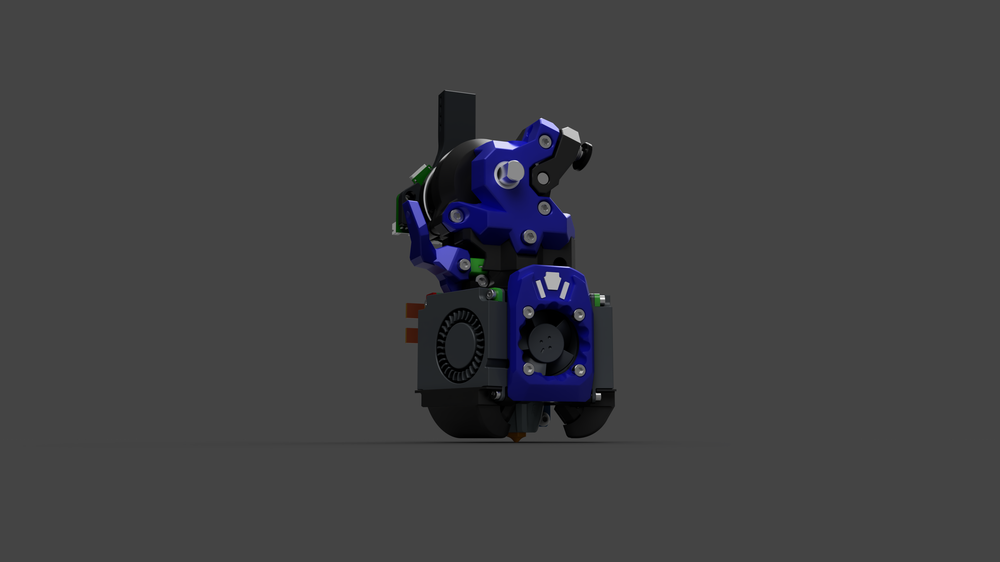

# Xol-metrix

This is a filament cutter designed around the Xol 2 platform thanks to everyone that helped with the BETA process to get this project into a phase that I am comfortable in calling a released state. There will still be some small adjustments I will make when more feedback is given.

I will support the next iteration of Xol 2 when DW Tas has put it into a released state.

I do ask that if anyone makes any mods let me know so we can discuss if it makes since to put it in the repo.

So far the project supports the following.

### Hotends

- Dragon SF/UHF/ACE
- NF-Crazy
- Rapido SF/UHF
- Revo Voron
- Bambu Labs *In BETA since official XOL 2 doesn't really support it yet*

### Extruders

- [Wrist Watch G2](https://github.com/tetsu97/WristWatch-G2-Extruder)
- [Sherpa Mini](https://github.com/Annex-Engineering/Sherpa_Mini-Extruder)
- [Orbiter](https://www.orbiterprojects.com/orbiter-v2-0/)
- [G2SA](https://github.com/tetsu97/Galileo2)
- [VZ Hextrudort](https://github.com/VzBoT3D/Vz-HextrudORT) / [Bondtech LGX Lite](https://www.bondtech.se/product/lgx-lite-v2-large-gears-extruder/)
## BOM

This is addition to your choice of Xol 2 build BOM

|Qty|Item|Notes|
|-|-|-|
|2|M2 Flanged Heatset Insert|Specifically this heatset [HM20X157C](https://www.digikey.com/en/products/detail/tri-star-industries-inc/HM20X157C/14205393)|
|1|M2.5 Heatset Insert|3.5mm Outer Diameter x 4mm Length `Same as Xol 2 BOM`|
|3|M2 Heatset Insert|3.5mm Outer Diameter x 4mm Length `Same as Xol 2 BOM`|
|2|M2.5x15 SHCS|For mounting the arm to the frame and blade holder.|
|3|M2x8 SHCS|To hold the extruder adapter together.|
|1|5.5mm Ball Bearing|For toolhead filament sensor. `Same as ERCF BOM`|
|1|Omron D2F Micro Switch|Tis be switch that does clicky things.|
|2|M2x10 Self Tapping|It really doesn't matter what type just has to self tap.|
|1|0.5x4x15 Spring|Any spring that is 4mm in diameter and no longer than 15mm should work your milage may vary for cutting force needed.|
|Yes|PTFE Tube|Still working out exact lengths and possibly cutting jigs.|
|**OPTIONS**|
|1|#4 metal hobby blades|Same blade used in the Filametrix only cut to a different length.|
|**OR**|
|1|OLFA KB4-F/5|Different blade otion if you are having problems with #4 blades.|
|**OPTIONAL**|
|1|M3 Grubscrew|Same ones used to secure pulleys **totally optional**.|

## Acknowledgements

 - [Xol-Toolhead](https://github.com/Armchair-Heavy-Industries/Xol-Toolhead) For Xol 2 project
 - [WristWatch-G2-Extruder](https://github.com/tetsu97/WristWatch-G2-Extruder) For WWG2 and Extruder adapter
 - [Filametrix](https://github.com/sorted01/Filametrix) For the orginal mod idea
 - Thanks to Tea/`nurse.shark` for alowing me to use the Xolametrix name (I did change it slightly)

## Feedback

- [Armchair Discord User Projects Discussion](https://discord.com/channels/1029426383614648421/1195580104659710053)
- My Discord `southash1`
